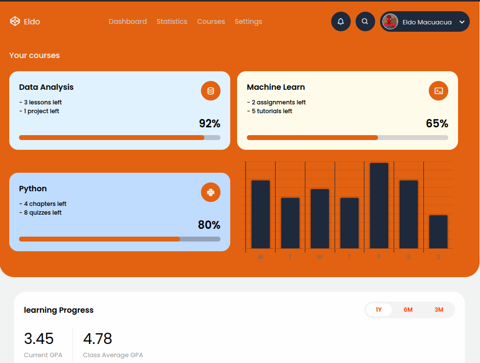

# Dashboard Design
A modern, fully responsive portfolio website built using HTML, CSS, and JavaScript. This project incorporates advanced techniques such as CSS Grid, CSS Flexbox, media queries, and CSS transitions to ensure a smooth user experience and stunning visual effects.

## Features
<ul>
    <li>Responsive Design: Adapts seamlessly to different screen sizes, from desktops to mobile devices.</li>
    <li>Scroll To Element: Smooth scrolling functionality to navigate between sections with ease.</li>
    <li>Modern Layout: A clean, professional layout using CSS Grid and Flexbox.</li>
    <li>Animations: Subtle animations and transitions for an engaging user experience.</li>
</ul>

## Technologies Used
HTML: For structuring the web pages.

CSS: For styling and layout, including Grid, Flexbox, and media queries.

JavaScript: For implementing scroll functionality and interactivity.

## Screenshot
Here we have project screenshot :

